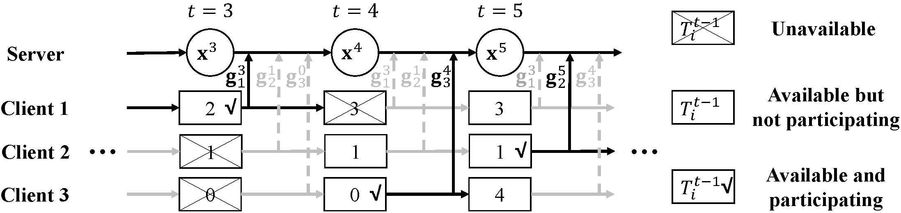

# Federated-Latest-Averaging

## Algorithm illustration


# Building
In Linux, to initialize the project, please type the following commands in your shell.
```shell script
# install packages
conda create -n FedLaAvg python==3.6.9
conda activate FedLaAvg
pip install -r requirements.txt

# configuring project
echo -e "use_cuda = False\nproject_dir = \"$(pwd)\"" > src/config.py

# generating initial model
mkdir cache data
python src/train/model.py

# download glove embedding
mkdir -p models/glove/
wget -P models/glove/ http://nlp.stanford.edu/data/glove.twitter.27B.zip
unzip -d models/glove/ models/glove/glove.twitter.27B.zip

# download sentiment dataset
mkdir -p raw_data/Sentiment140
wget -P raw_data/Sentiment140/ http://cs.stanford.edu/people/alecmgo/trainingandtestdata.zip
unzip -d raw_data/Sentiment140/ raw_data/Sentiment140/trainingandtestdata.zip
```

# Replicating
In the root directory, run the scripts in [scripts](scripts) to reproduce the results in the paper.
For example: `sh scripts/MNIST-FedAvg.sh`.
